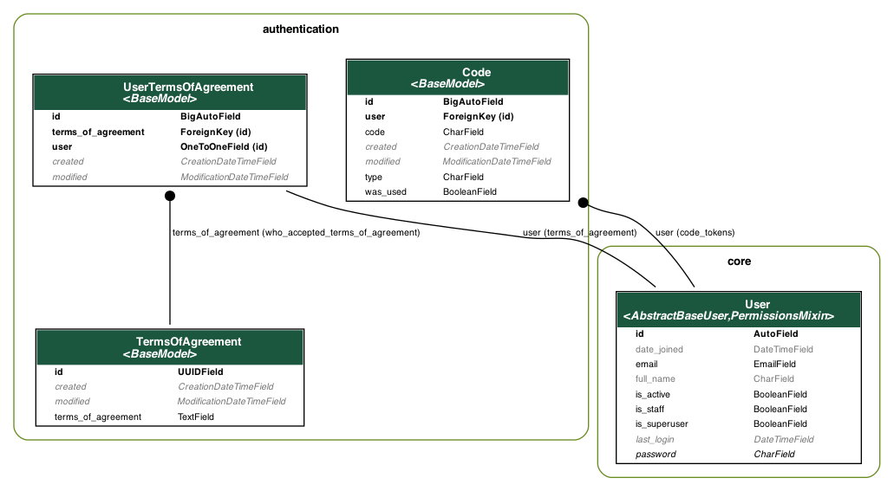

Welcome to the Starter Django Project, a solid foundation to kickstart your Django web application development. This starter project is designed to streamline your development process by providing essential structures, configurations, and best practices. Whether you're building a new project from scratch or looking to enhance an existing one, this starter project has you covered.

## Project Content

**Docker Ready:** This project is Docker-ready for both local development and seamless deployment to production environments. Dockerization ensures consistent behavior across different setups.

**Dotenv Configuration:** Centralize your configuration using dotenv files. Easily manage environment-specific variables without exposing sensitive information.

**Testing Setup with Pytest:** The project includes a robust testing setup with the Pytest framework. Write comprehensive test cases and ensure the reliability of your codebase.

**Continuous Integration (CI):** The CI workflow is configured to run Pytest, flake8, black, isort, and MyPy. It enforces code quality and compliance with best practices.

**Pre-commit Hooks:** Maintain code consistency with pre-commit hooks for flake8, black, isort, and MyPy. Code formatting and type checking are automatically enforced before each commit.

**Makefile Convenience:** The included Makefile provides a set of useful commands, streamlining common development tasks and making project management easier.

**Development Tools:** Benefit from development packages like Django Debug Toolbar and Django Extensions for enhanced debugging and exploration.

**API Documentation with Swagger:** Leverage the power of drf-spectacular to automatically generate an interactive Swagger documentation page for your APIs.

**Serializer and Pagination Helpers:** Included helper functions simplify the handling of serializers and pagination, saving development time and effort.

**Integrations**
- Sentry Integration: Error tracking is seamlessly integrated using Sentry. As soon as you set the SENTRY_DSN environment variable, error tracing is enabled.
- CloudWatch Logging: CloudWatch logging integration is automated when the necessary environment variables are configured. Monitor application performance and logs with ease.

**Models**
BaseModel Inheritance: All models except the user model inherit from the BaseModel, providing a consistent and organized data structure.

- User Model: The user model serves as a foundational custom model that can be tailored to fit the requirements of any project.
- Code Model: The versatile code model can be adapted for various purposes, such as implementing reset password flows.
- Terms of Agreements Model: Use the terms of agreements model to create agreements and establish relationships with users who have accepted the terms.




## Requirements

* Python (3.11.*) [Installation](https://www.python.org/downloads/ "Installation")
* Homebrew [Installation](https://brew.sh/ "Installation") 

**IMPORTANT**:
Docker Compose is used _just_ for development environment. The Dockerfile works without it.
* Docker [Installation](https://docs.docker.com/desktop/mac/install/ "Installation")


## Stack

- Django 4.1
- Django-rest-framework 3.14.0
- Postgres


## How to run

Rename the file `src/core/local.example.env` to `src/core/local.env`
```bash
$ python3.11 -m venv venv
$ source venv/bin/activate
$ make install-req
$ make install-dev-req
$ make install-test-req
```
Change ```db``` at DATABASE_URL var at local.env to ```localhost```
```bash
$ docker-compose up -d db
$ python src/manage.py migrate
$ python src/manage.py collectstatic
$ make test
$ python src/manage.py createsuperuser
$ make run
```
* Access [http://localhost:8000/admin/](http://localhost:8000/admin/)

## Running with Docker

```bash
docker-compose up -d
```

* Access http://localhost:8000/admin/


## Database

Running the database on the latest PostgreSQL Docker container in the port `5432`; the connection is defined by the `dj-database-url` package. There's a race condition script to avoid running Django before the database goes up.


## Styleguide

Before utilizing this starter, we highly recommend reviewing our comprehensive styleguide to gain a clear understanding of how it is intended to be used.

[Read the Styleguide](docs/styleguide.md)

The styleguide provides essential guidelines and best practices for various aspects of the project, including:

**Models:** Tips and conventions for creating well-structured Django models, defining validation methods, and using constraints.
**APIs:** Guidelines for versioning APIs, organizing modules, creating views, and utilizing serializers to handle data validation and transformation.
**Views:** Recommendations for structuring API views, separating business logic from views, and ensuring consistent JSON response formats.
and more...

By following the styleguide, you can maintain a consistent codebase, improve code readability, and enhance collaboration among team members. It serves as a valuable resource to ensure that the project adheres to our development standards and best practices.

Make sure to refer to the styleguide regularly during the development process to stay aligned with our team's coding conventions and ensure a high-quality end product.

